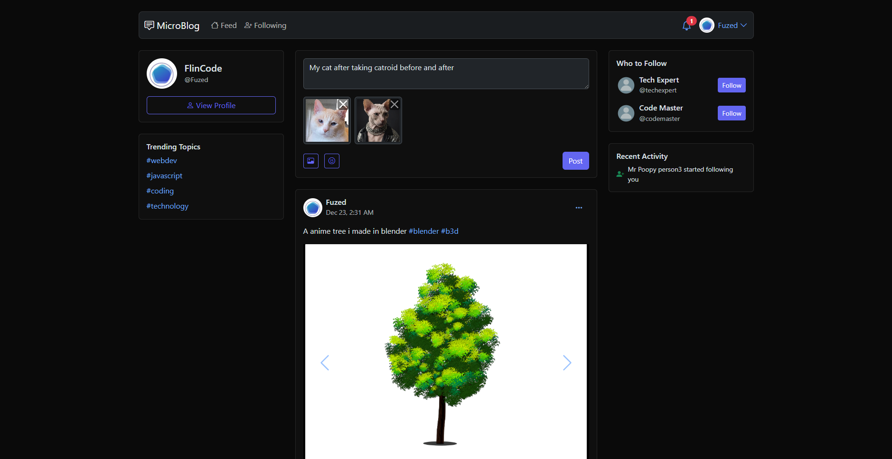

# MicroLog - A MicroBlogging Platform

A simple yet feature-rich microblogging platform built with Express.js, designed for users to share their thoughts, connect with others, and explore a community of ideas.




## Table of Contents

- [Features](#features)
- [Getting Started](#getting-started)
    - [Prerequisites](#prerequisites)
    - [Installation](#installation)
    - [Configuration](#configuration)
- [Usage](#usage)
- [Project Structure](#project-structure)
- [Dependencies](#dependencies)
- [Contributing](#contributing)
- [License](#license)

## Features

-   **User Authentication:** Secure registration and login system using bcrypt and JWT.
-   **Profile Management:** Users can create and edit their profiles, including profile pictures, bios, and notification settings.
-   **Post Creation:** Users can create text-based posts with optional image uploads.
-   **Feed Exploration:** Explore a feed of posts from other users.
-   **Public Profiles:** View other users' profiles and posts.
-   **Following:** Follow and unfollow other users.
-   **Hashtag Support:** Posts can include hashtags for easy content discovery.
-   **Image Uploads:** Upload multiple images to posts using Cloudinary.
-   **Live Reload:** Development environment with live reloading for faster development.
-   **Responsive Design:** Utilizes Bootstrap for a responsive and user-friendly interface.
-   **Real-time Notifications:** (Future Implementation) System notifications for new followers, likes, and comments.

## Getting Started

### Prerequisites

-   [Node.js](https://nodejs.org/) (v18 or higher)
-   [npm](https://www.npmjs.com/) (or [yarn](https://yarnpkg.com/))
-   [MongoDB](https://www.mongodb.com/) (local or cloud instance)
-   [Cloudinary](https://cloudinary.com/) account for image storage

### Installation

1.  Clone the repository:

    ```bash
    git clone <repository-url>
    cd jexpress
    ```

2.  Install dependencies:

    ```bash
    npm install
    ```

### Configuration

1.  Create a `.env` file in the root directory.
2.  Add the following environment variables, replacing the placeholders with your actual values:

    ```env
    PORT=3000
    MONGO_URI=<your-mongodb-connection-string>
    JWT_SECRET=<your-jwt-secret>
    CLOUDINARY_CLOUD_NAME=<your-cloudinary-cloud-name>
    CLOUDINARY_API_KEY=<your-cloudinary-api-key>
    CLOUDINARY_API_SECRET=<your-cloudinary-api-secret>
    ```

    *   `PORT`: The port the server will run on.
    *   `MONGO_URI`: Your MongoDB connection string.
    *   `JWT_SECRET`: A secret key for signing JSON Web Tokens.
    *   `CLOUDINARY_*`: Your Cloudinary API credentials.

## Usage

1.  Start the development server:

    ```bash
    npm run dev
    ```

2.  Open your browser and navigate to `http://localhost:3000`.

3.  Register a new account or log in with an existing one.

4.  Start sharing your thoughts and exploring the community!

## Dependencies

The project uses the following main dependencies (see `package.json` for full list):

-   `express`: Web framework for Node.js.
-   `mongoose`: MongoDB object modeling tool.
-   `bcrypt`: Password hashing library.
-   `jsonwebtoken`: JSON Web Token implementation.
-   `cloudinary`: Cloud-based image and video management.
-   `dotenv`: Loads environment variables from a `.env` file.
-   `ejs`: Templating engine.
-   `express-fileupload`: Middleware for handling file uploads.
-   `livereload` & `connect-livereload`: For live reloading during development.
-   `cookie-parser`: For parsing cookies.
-   `sanitize-html`: For sanitizing HTML input.

## Contributing

Contributions are welcome! Please feel free to submit a pull request or open an issue to discuss potential changes.

## License

This project is open-source and available under the [MIT License](LICENSE).